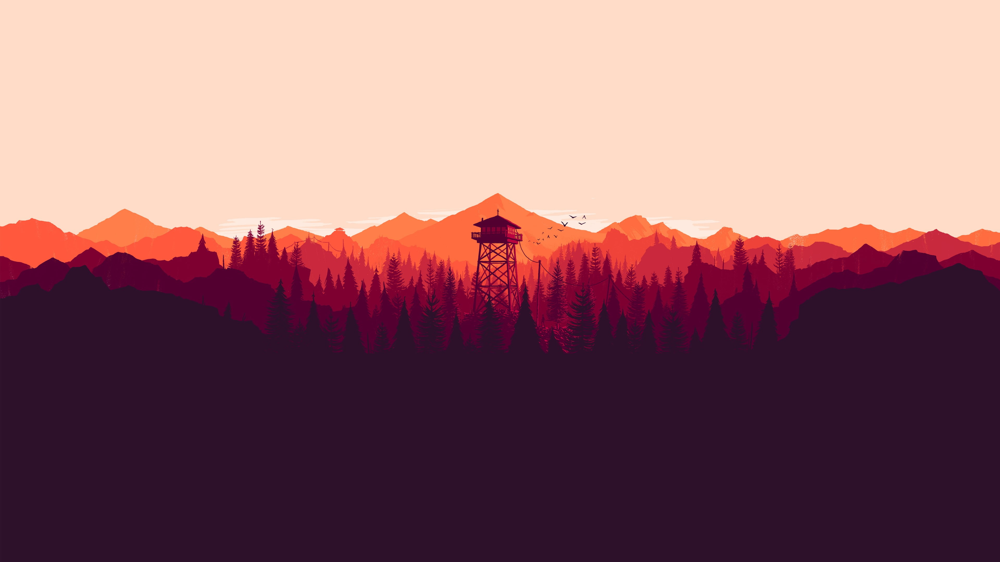

# Tafif Assiddiqi - Personal Portfolio



Welcome to my personal website source code. This project has been modernized from a legacy HTML/Bootstrap template to a fast, component-based **Astro** application.

## 🚀 Tech Stack

- **Framework**: [Astro v5](https://astro.build/) - For blazing fast static site generation.
- **Styling**:
  - **Bootstrap 5** (via BootstrapBrain) for responsive grid and legacy component support.
  - **CSS Modules/Scoped CSS** for custom modern enhancements (Glassmorphism, Animations).
  - **Fonts**: 'Outfit' (Google Fonts) for a modern, geometric look.
- **Interactivity**:
  - Vanilla JS & Astro Islands.
  - Legacy support for jQuery/Isotope (Portfolio filtering).

## 📂 Project Structure

- `src/pages/` - Content pages (Home, About, Portfolio).
- `src/components/` - Reusable UI components (Navbar, Footer).
- `src/layouts/` - Main site layout.
- `public/assets/` - Static assets (Images, CSS, JS).
- `public/legacy/` - Archived projects and legacy demos.

## 🛠️ Getting Started

1. **Install dependencies**:

   ```bash
   pnpm install
   ```

2. **Start Development Server**:

   ```bash
   pnpm dev
   ```

3. **Build for Production**:
   ```bash
   pnpm build
   ```

## 📝 Features

- **Responsive Design**: Looks great on Mobile and Desktop.
- **Project Showcase**: Filterable portfolio grid.
- **Performance**: Optimized by Astro for zero-JS by default (except where needed).
- **SEO Friendly**: Meta tags and structured data ready.

## 📄 License

All Rights Reserved © 2025 Tafif Assiddiqi.
